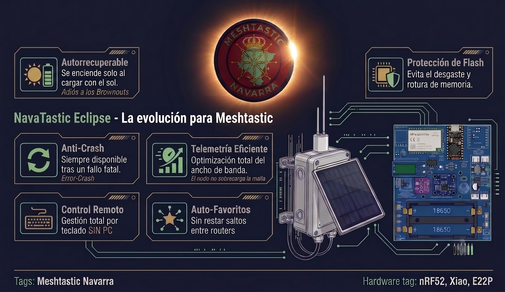

<div align="center">



<br/>

[](https://ko-fi.com/ea2oy)
[-brightgreen?logo=checkmarx&logoColor=white)](https://github.com/meshtastic/firmware/tree/v2.8.0.7239fe8)
[](https://github.com/EA2OY/NavaTasticV6/releases)

</div>

> ℹ️ **NavaTastic V6** es la generación construida sobre **Meshtastic 2.8.0 oficial** (commit
> `7239fe8`), heredando todo lo que ya funcionaba en **NavaTastic Eclipse V5.3.1** (base 2.7.26).
> El árbol es el del firmware oficial **con los cambios del fork encima**: `git diff` contra la base
> oficial muestra exactamente lo nuestro.
>
> 🔧 **Novedad de la V6**: el **enlace de canales** (`/nava set_url`) hereda las 7 correcciones de la
> V5.3.1 — acepta el canal principal de un preset avisando de que lo lee cualquiera, **nunca toca la
> potencia del nodo**, aplica los canales secundarios tal cual vienen y deja rastro de los rechazos.
>
> 💡 **Lo más fácil**: el **[flasher web](https://ea2oy.github.io/NavaTastic-Flasher/)** graba el firmware en el nodo
> desde el navegador, sin instalar nada (nRF52840 y Heltec V3/V4).

---

**NavaTastic** es un firmware optimizado y endurecido sobre la base de [Meshtastic](https://meshtastic.org) **v2.8.0**, diseñado específicamente para **repetidores solares autónomos de alta montaña e infraestructura fija** en la red LoRa de España (**SFNarrow / EU_868**).

Con un solo código fuente genera **16 firmwares listos para usar** (6 tipos de placas/radios nRF52840 + **Heltec V3 y V4** ESP32-S3, en ramas de Routers y Clientes) desde **16 entornos de compilación** en total.

<div align="center">

[-blue?style=for-the-badge&logo=github)](https://github.com/EA2OY/NavaTasticV6/releases)

[](https://ea2oy.github.io/NavaTastic-Flasher/)

</div>

## 🧠 ¿Qué le añade NavaTastic al firmware normal?

Un repetidor solar instalado en una cumbre aislada no puede fallar: si se bloquea por una caída
de tensión, si quema su memoria flash interna o si pierde su configuración tras un reinicio,
exigiría subir a la montaña a pie para repararlo. NavaTastic resuelve de raíz los grandes
problemas del firmware estándar:

☀️ **Resiliencia energética.** Si el nodo se queda sin batería, ya no entra en brownout: te
escribe un mensaje avisando de que tiene batería baja, se programa para despertar cuando la
tensión suba de cierto umbral y se pasa a sueño profundo — microcontrolador y radio dormidos,
con un consumo de **0.4 mA** — hasta que salga el sol, recupere energía suficiente y vuelva a
arrancar. El despertar lo decide un comparador analógico por hardware (LPCOMP) cuando la batería
se ha recargado de verdad (≥ 3.77 V), sin bucles de amanecer. Entonces despierta y te escribe
otro mensaje diciendo que está listo para trabajar.

💾 **Protección de la memoria flash.** En una malla grande, todos los nodos mandan NodeInfos y
mensajes; en el firmware oficial eso provoca escrituras constantes en la flash y acorta su vida
útil — a medio plazo acaba rompiendo el microcontrolador por desgaste. NavaTastic elimina las
escrituras innecesarias: la base de datos de nodos y los diagnósticos (`stats`, `log`, `mute`,
`test_tx`) operan al 100% en memoria RAM, protegiendo y alargando la vida del nodo.

⭐ **Auto-favoritos activado por defecto.** Si el nodo es Router, detecta los otros routers que
ve en directo y los agrega a favoritos (hasta 32), beneficiándose del sistema *zero-hop* de
Meshtastic para que los routers de infraestructura no resten saltos. Los favoritos también se
gestionan a distancia por radio (`/nava fav`), sin cables.

📡 **Más de 50 comandos para gestionarlo todo sin ordenador.** Sin cable ni CLI: ver qué nodos
ve en directo, ver o agregar favoritos, ignorar nodos que molestan, ver el estado real, el nivel
de ruido, la batería, los sensores de clima y de energía... casi cualquier cosa que necesites.
Todo por mensajes cifrados, con sincronización transparente con la App oficial de Meshtastic y
soporte para **MeshNavarra Utility**.

🛡️ **Se recupera solo de los resets.** Si el nodo sufre un fallo que provoca un reset de
fábrica indeseado, no se queda aislado esperando a que vayas físicamente: vuelve a la malla
tratando de respetar los ajustes que ya le habías puesto — claves de administración, canales
secundarios, configuración de radio y parámetros de rescate quedan protegidos y sobreviven a
cualquier reset de configuración — hasta las claves de administración remota. Si el fallo es
fatal, tampoco se queda aislado: vuelve a la malla SFN con una clave de administración de
rescate que te permite dejarlo como estaba, evitando el desplazamiento.
⚠️ **Importante**: esa clave de administración de rescate es una **red de seguridad**, no tu
llave de uso diario. Si el nodo es tuyo, **configura tu propia clave de administración y
desautoriza la de emergencia**: mientras tengas la tuya puesta, la de emergencia no manda.
Solo se reinyecta sola en un caso — si el nodo sufre un fallo catastrófico de memoria o un
restablecimiento total y se queda sin ninguna clave tuya. (Cómo hacerlo: guía rápida, paso 6.)

🔑 **El respaldo interno solo entra cuando el nodo se queda sin ninguna clave tuya**: si borras
una clave desde la App, el borrado se respeta al reiniciar — el nodo ya no la resucita.

📊 **Buenas Prácticas aplicadas.** El nodo se configura con las recomendaciones de una de las
mallas más grandes del mundo: prioridad y espacio para la mensajería de las personas. Los
NodeInfos, las posiciones GPS y las telemetrías se ajustan a 72h/72h/12h para optimizar la red,
y se eliminan los acuses de recibo que provocaban las "tormentas de NodeInfo" (que todos los
nodos intenten responder a la vez): el repetidor anuncia su identidad **sin exigir respuesta a
toda la red**, manteniendo el canal limpio.

🚨 **Botón del pánico.** Con una sola orden, toda tu malla migra al preset LoRa que elijas
(MediumFast, LongFast...), facilitando el aislamiento bajo demanda, puntual o fijo — con
reversión automática programable si lo necesitas. La orden se propaga de repetidor en
repetidor por el canal privado, aunque el mando solo tenga cobertura con uno.

---

## ⚡ Guía Rápida de Instalación en 5 Pasos (Para quien tiene prisa)

> 💡 **Ya NO hace falta el reset de fábrica**: al flashear, el firmware se configura solo
> (canal `Navadmin` + buenas prácticas) y respeta tus claves. Espera un minuto.

```
1. **Comprueba que tu hardware es compatible**
2. **Flashea el firmware** (UF2 / OTA)
3. **Guarda tu clave privada** *(opcional)*
4. **Sin reset: se despliega solo** — espera un minuto
5. **Añade el canal `Navadmin` (PSK `AQ==`)** en tu mando
6. **Pon TU clave de administración** y deja fuera la de emergencia (paso 6 abajo)
```

### 1️⃣ Paso 1: Comprueba que tu Hardware es Compatible
* **Microcontrolador**: Compatible con placas **Nordic nRF52840** (Promicro DIY + E22P, Faketec, Seeed Xiao, Xiao Kit i2c, Xiao Kit i2c + E22P, Heltec T114) y **ESP32-S3** (Heltec V3, Heltec V4). *(Revisa la tabla de descargas abajo)*.
* **Divisor de Batería**: Las placas DIY deben llevar un divisor resistivo **1 MΩ + 1 MΩ (factor 2.0)** para que la medición ADC y el comparador de corte solar **LPCOMP** funcionen con precisión.

### 2️⃣ Paso 2: Flashea el Firmware NavaTastic
* **Lo más fácil, sin instalar nada**: el **[flasher web](https://ea2oy.github.io/NavaTastic-Flasher/)** graba el nodo desde el propio navegador (Chrome, Edge o Firefox recientes, en un ordenador).
* **Vía Cable USB (.UF2)**: Conecta la placa al PC, haz **doble pulsación rápida en el botón RESET** para que aparezca la unidad de disco USB (`NICENANO` o similar) y arrastra el archivo `.uf2` correspondiente a tu placa.
* **Vía Actualización OTA (.zip)**: Si ya estás conectado por Bluetooth, actualiza desde la App oficial de Meshtastic seleccionando el `.zip` OTA.
* **Emparejamiento Bluetooth**: El PIN de conexión por defecto es **`654321`** (modo `FIXED_PIN`).
* **Saber qué versión lleva el nodo**: la etiqueta **`NavaTastic V6`** va compilada dentro del binario y se ve en `/nava status` y en el aviso `[Boot]`.

### 3️⃣ Paso 3: Respalda tu Clave Privada *(Opcional)*
* Si deseas **mantener la misma identidad de nodo y tus conversaciones previas**, copia tu clave privada (`private_key`) desde la App antes del reseteo para restaurarla después. Si es un nodo nuevo, salta este paso y el firmware generará una identidad limpia Curve25519.

### 4️⃣ Paso 4: ✅ YA NO HACE FALTA FACTORY RESET (desde la V5)
* **¿Por qué?** Desde la V5, al flashear NavaTastic el propio firmware **se despliega solo** en
  el primer arranque: materializa el canal `Navadmin` en el Slot 1, aplica las buenas prácticas
  (72h/72h/12h) y **respeta las claves del dueño** si el nodo ya tenía alguna.
* **Qué hacer**: nada. Espera un minuto tras flashear y el nodo queda operativo y configurado.
* **Importante: no se conserva lo mismo en los dos casos.**
  * Si tu nodo **ya llevaba NavaTastic** (aunque después le hayas puesto encima el firmware oficial): **no se borra nada** — tus canales, tu modulación, tu rol, tus claves y tu nombre se quedan como estaban.
  * Si el nodo **viene de fábrica con Meshtastic oficial** (nunca tuvo NavaTastic): se le instala la configuración estándar del proyecto (**SFNarrow + Navadmin** y la radio estándar). Se conservan tu **identidad de nodo** (el par de claves, para que tus mensajes privados sigan funcionando), tus **claves de administración** y tu **nombre**. Los canales y la modulación que trajera se sustituyen por el estándar.

> 🚫 **NO uses "Restaurar copia de seguridad" de la App de Meshtastic.** El nodo se blinda solo con
> su respaldo interno y esa función **se ha llevado nodos por delante** (ha obligado a subir a la
> montaña a repararlos). La restauración se deshace sola al reiniciar y puede dejar el nodo sin
> responder.

### 5️⃣ Paso 5: Añade el Canal `Navadmin` en tu Móvil Administrador
* Para gestionar el repetidor por radio desde tu móvil o mando de campo, crea en tu App de Meshtastic un canal secundario con estos parámetros:
  * **Nombre del canal**: `Navadmin` (respetando mayúsculas/minúsculas).
  * **Clave (PSK)**: `AQ==` (clave por defecto de Meshtastic `{ 0x01 }` / Default).
* ¡Listo! Ahora abre el canal `Navadmin` y envía `/nava ping` o abre la app oficial **[MeshNavarra](https://github.com/EA2OY/MeshNavarra)** para controlar tu repetidor con un solo toque.
* 🔄 **Sincronización Bidireccional**: cualquier cambio que hagas en la App Oficial de Meshtastic (rol, canales, posición fija, telemetría, LoRa preset o PIN) **se sincroniza automáticamente con el respaldo interno del nodo**, por lo que tus ajustes persisten limpiamente sin revertirse al reiniciar.

### 🔐 6️⃣ Paso 6 (muy recomendado): haz tuyo el nodo — tus claves de administración

* El repetidor trae de fábrica **una clave de administración de emergencia** (la del proyecto). Es una **red de seguridad**: sirve para poder recuperar por radio un nodo que se haya quedado sin dueño tras un fallo grave.
* Si el repetidor es tuyo, **pon tu propia clave de administración** y deja de depender de la de emergencia. Mientras tu clave esté en el nodo, **la de emergencia no autoriza nada**: queda desplazada, y lo sigue estando después de un restablecimiento de fábrica.
* La clave de emergencia **solo reaparece sola** en un caso: si el nodo sufre un **fallo catastrófico de memoria o un restablecimiento total** y se queda **sin ninguna clave tuya**. Es entonces cuando actúa como salvaguarda para que puedas volver a entrar y dejarlo como estaba.
* **Cómo poner tu clave**: si compilas tu propio firmware, edítala en tu perfil de compilación (`profiles/`, ver la guía de compilación). En un nodo ya desplegado, añade la **clave pública de tu mando** en el lugar de la de emergencia desde tu cliente de administración, y compruébalo con `/nava admin_ls` (te muestra qué claves mandan en el nodo).

### 🔧 ¿Prefieres hacerlo a mano? Compilar o flashear binarios

- **[Flasher web](https://ea2oy.github.io/NavaTastic-Flasher/)**: graba el firmware desde el navegador, sin instalar programas (nRF52840 y Heltec V3/V4)
- **Compilar desde el código**: `pio run` compila de una vez los **16 entornos de infraestructura**
  (12 nRF52840 + 4 ESP32) definidos en `default_envs`; para una sola placa, `pio run -e <entorno>`.

---

## 📥 Descargas: elige tu archivo y encuentra los manuales

En cada [Release](https://github.com/EA2OY/NavaTasticV6/releases) encontrarás un archivo por placa.
Regla rápida para no equivocarte:

* **Busca tu placa en el nombre**: `Promicro...`, `Faketec...`, `Seed.Solar.Node.P1...`,
  `Heltec.T114...`, `XiaoKitI2c...`, `XiaoKitI2c+E22P...`, `HeltecV3...` o `HeltecV4...`.
* **Elige el rol**: sufijo `R2IG` (o `r2ig` en Heltec) = **Repetidor fijo** (router de
  infraestructura); sufijo `R1IG` (o `r1ig`) = **Cliente convertible a Repetidor**.
* **Elige el formato**: `.uf2` = por cable USB · `.zip` = actualización OTA por Bluetooth ·
  en Heltec V3/V4 los archivos son `.APP.bin` y `.FACTORY.bin`.
* **Batería**: todos los firmwares funcionan con **LiPo**. Si usas batería **NiMH**, elige una
  placa **Faketec o Xiao Kit i2c** (compatibilidad declarada por el autor) y configura la
  química con `/nava set_chem`. El mismo archivo sirve para ambas químicas.

**Estado de pruebas**: verificado en banco en **Faketec, Promicro NRF52+E22P, Xiao Kit i2c y
Xiao Kit i2c+E22P** · en pruebas de campo en **Seed Solar P1, Heltec T114 y Heltec V3/V4**.
*(Estado heredado de la serie V5; la V6 está pendiente de la campaña de pruebas sobre la base 2.8.0.)*


---

## ☀️ Los 5 Estados del Ciclo Solar (Avisos Automáticos)

El repetidor informa a la red de su estado de salud en tiempo real a través del canal Navadmin o canal privado asignado:

1. **`[Listo]`** ($\ge 3.77\text{ V}$): Recuperación solar completada $\rightarrow$ El nodo anuncia *"despierto, cargando, listo para trabajar"* y opera de forma ininterrumpida.
2. **`[Vivo]`** ($3.30\text{V} - 3.40\text{ V}$): Batería al límite (Nivel 1) $\rightarrow$ Anuncia *"sigo vivo, al límite de carga"* y opera 160s. Si la batería no remonta, vuelve a dormir.
3. **`[Critico]`** ($< 3.30\text{ V}$): Capacidad crítica (Nivel 2) $\rightarrow$ Anuncia *"bateria en capacidad critica, operando 160s"* y se apaga limpiamente a **0.4 mA**. Permite al operador monitorizar día a día la rampa de recuperación solar en días nublados.
4. **`[Sueño]`**: Corte de batería $\rightarrow$ Emite el aviso de despedida con la tensión exacta del ADC y la temperatura del chip, apagando la radio por bus SPI.
5. **`[Boot]`**: Diagnóstico diferido a los **3 minutos** de uptime tras un reinicio en frío $\rightarrow$ Reporta la causa hardware del reinicio (`WDT`, `RESETPIN`, `SOFT`, `LPCOMP`, `VBUS`, etc.) y la versión **`NavaTastic V6`**. El retardo actúa como anti-bucle de malla.

---

## 💻 NavaCLI: Gestiona todo desde el móvil, sin PC

Con un simple mensaje de texto (DM al repetidor o en canal privado de flota) manejas el nodo completo: **no hace falta cable, ni PC, ni abrir la interfaz normal de administración**. Toda la gestión del nodo — consultar su estado, ajustar energía, reiniciar con ventana de gracia de 6s, conmutar presets LoRa, evacuar en pánico o gestionar la flota en lote — cabe en un mensaje.

| Comando | Qué hace | Nivel de Acceso |
| :--- | :--- | :--- |
| **`ping` · `status` · `bat` · `power`** | Métricas rápidas: latencia · salud de memoria y versión `NavaTastic V6` · % OCV · energía ADC + INA219 | **Canal Abierto / Privado / DM** |
| **`env` · `channel` · `noise`** | Telemetría sensores I2C · ocupación de canal airtime % · piso de ruido LoRa en dBm | **Canal Abierto / Privado / DM** |
| **`peers` · `rxlog` · `afc` · `reset_reason`** | Vecinos directos · últimos 5 paquetes recibidos · deriva TCXO Hz · motivo del reinicio (RESETREAS) | **Broadcast con `!ID` / Privado / DM** |
| **`stats` · `log [n]` · `route` · `trace`** | Auditoría de extremos (temperatura, batería, tráfico RX/TX/Enrutados) · buffer RAM · traceroute desacoplado (8s) | **Broadcast con `!ID` / Privado / DM** |
| **`set_preset` · `set_lora` · `set_freq`** | Cambio de preset LoRa estándar · ajuste custom (BW/SF/CR/Freq/Slot/Power) · frecuencia | **Canal Privado / DM** |
| **`panic` · `panic_ok`** | Evacuación simultánea de toda la cordillera en $T$ minutos · consolidación / cancelación de retorno | **Canal Privado / DM** |
| **`ch_ls` · `ch_set` · `ch_del` · `ch_url`** | Gestión de Canal 0 y secundarios (0-7) · configuración con clave Base64 · exportación URL Meshtastic | **Canal Privado / DM** |
| **`set_cli_chan` · `navadmin_mute` · `ch_reset`** | Redirección de CLI a canal privado · silenciamiento de Navadmin · reset de canales a fábrica | **Canal Privado / DM** |
| **`set_ok_to_mqtt` · `ch_mqtt`** | Autorización global MQTT de la flota · conmutación granular de pasarela por canal | **Canal Privado (Lote) / DM** |
| **`set_pos_tx` · `set_nodeinfo_tx` · `set_telem_tx`** | Control de difusión periódica de posición (72h/off) · NodeInfo de flota · cadencia telemetría | **Canal Privado (Lote) / DM** |
| **`ign add/del/clear/ls`** | Lista negra persistente contra nodos saboteadores/spam (descarte inmediato en enrutador) | **Canal Privado (Lote) / DM** |
| **`mute` · `test_tx` · `db_purge`** | Silenciado temporal de reenvío · ráfaga de prueba RF · purga de memoria RAM | **Canal Privado (Lote) / DM** |
| **`set_pos` · `pos_clear` · `set_name` · `set_pin`** | Coordenadas fijas persistentes · borrado de posición fija · nombre persistente a resets (`set_name flush`) · PIN BLE fijo | **Individual (`!ID`) / DM** |
| **`set_chem` · `set_vbat` · `set_vwake`** | Cambio de química de batería (`lipo/nimh/sodium/lifepo4`) · umbral de corte mV · despertar LPCOMP | **Canal Privado / DM** |
| **`set_txpower` · `set_hops` · `set_role` · `set_tz`** | Potencia de transmisión LoRa · límite de saltos · cambio de rol semi-permanente · zona horaria | **Canal Privado / DM** |
| **`storm` · `txoff` · `txon` · `ble` · `sleepmsg`** | Hibernación por tormenta · control de transmisión LoRa · Bluetooth on/off · avisos solares | **Canal Privado / DM** |
| **`fav add/rm/ls/auto`** | Gestión de favoritos con bypass 0-Hop y auto-favoriteo de routers vecinos directos (hasta 32) | **Individual (`!ID`) / DM** |
| **`admin_ls` · `keys_ls` · `keys_clear`** | Consulta de claves admin activas · claves persistidas en disco · borrado de claves persistidas | **Solo DM de Administrador** |
| **`reboot` · `factory_reset` · `full_reset` · `wipe`** | Reinicio suave (gracia 6s) · reset de fábrica · reset completo sin perder claves PKI · purga nuclear | **Solo DM de Administrador** |

---

## 🧩 Cómo está hecho este repositorio

* **Base oficial**: [meshtastic/firmware](https://github.com/meshtastic/firmware) en el commit
  `7239fe8` (tag `v2.8.0.7239fe8`, **Meshtastic 2.8.0**).
* **Historia**: se conserva la historia completa del firmware oficial y **encima van los commits
  del fork**. No es una copia suelta: `git diff v2.8.0.7239fe8` muestra exactamente lo nuestro.
* **Lo que añade el fork**: el motor `src/modules/NavaCLIModule.*`, las variantes
  `variants/nrf52840/navarrico.ini` y `variants/esp32s3/navarrico_esp32.ini`, los **16 perfiles**
  de `profiles/` (R1IG/R2IG) y los cambios sobre el núcleo oficial (NodeDB, Router,
  RadioLibInterface, Power, PositionModule y las telemetrías, entre otros).
* **Entornos de compilación**: `default_envs` compila los **16 entornos de infraestructura**
  (12 nRF52840 + 4 ESP32) con un solo `pio run`.

## Licencia

- **Firmware (código de este repositorio)**: **GPL v3** — heredada de
  [meshtastic/firmware](https://github.com/meshtastic/firmware), del que NavaTastic es un fork.
  Ver [LICENSE](LICENSE). Las modificaciones de NavaTastic se publican bajo la misma licencia.
- **Cumplimiento GPL**: los binarios distribuidos en los Assets de los Releases tienen su
  código fuente completo en **este mismo repositorio, en el mismo commit**.
- **Hardware**: los diseños de placas (cuando se publiquen) se licenciarán aparte.

## Descargo de responsabilidad

- Este firmware se distribuye **SIN GARANTÍA DE NINGÚN TIPO**, bajo los términos de la GPL v3. Úsalo **bajo tu propia responsabilidad**.
- Un repetidor solar es un dispositivo que se instala en altura, con baterías y alimentación solar: el montaje, el dimensionado de batería/panel y el mantenimiento son responsabilidad del instalador.
- **Cumplimiento normativo del montaje**: toda instalación debe cumplir la normativa nacional, autonómica, local y europea aplicable.
- El proyecto queda **desvinculado** de cualquier montaje o uso de terceros.

## Agradecimientos

Este proyecto nació gracias a **JBAU92** y su [firmware_solar_fix](https://github.com/JBAU92/firmware_solar_fix): sin esa base e inspiración, NavaTastic no existiría. Gracias también a tod@s l@s amig@s y conocid@s de la **malla de Navarra** y de las **mallas cercanas amigas**, a los que guardo mucho aprecio y valoro enormemente su apoyo. He hecho grandes amistades gracias a todo esto, y a toda la gente del grupo **Meshtastic España** (Telegram) que me ha echado una mano, probado el firmware e inspirado en este camino.

Y gracias al equipo de **[Meshtastic](https://meshtastic.org)** por el firmware libre sobre el que
se construye todo esto.

## ☕ Apoyo voluntario al proyecto

Este proyecto es y será siempre **100% libre, abierto, gratuito y desarrollado de forma totalmente altruista** y desinteresada para la comunidad.

Si alguien, de manera **estrictamente voluntaria**, desea invitar a un café para ayudar a sufragar los costes de placas de prueba y componentes de laboratorio, puede hacerlo aquí:

<div align="center">

[](https://ko-fi.com/ea2oy)

</div>

---

# NavaTastic (English)

Firmware **NavaTastic** — an optimized and hardened [Meshtastic](https://meshtastic.org) **v2.8.0** fork for **solar-powered infrastructure repeaters** on the **SFNarrow** LoRa preset (EU_868). A single repository produces **16 ready-to-use firmwares** (6 nRF52840 boards + **Heltec V3 and V4** ESP32-S3, × 2 branches: Routers / Clients) from **16 build environments** in total.

<div align="center">

[-blue?style=for-the-badge&logo=github)](https://github.com/EA2OY/NavaTasticV6/releases)

[](https://ea2oy.github.io/NavaTastic-Flasher/)

</div>

<div align="center">

[-brightgreen?logo=checkmarx&logoColor=white)](https://github.com/meshtastic/firmware/tree/v2.8.0.7239fe8)
[](https://github.com/EA2OY/NavaTasticV6/releases)

</div>

> ℹ️ **NavaTastic V6** is the generation built on **official Meshtastic 2.8.0** (commit `7239fe8`),
> inheriting everything that already worked in **NavaTastic Eclipse V5.3.1** (2.7.26 base).
> The tree is the official firmware **with the fork's changes on top**: `git diff` against the
> official base shows exactly what is ours.
>
> 🔧 **What is new in V6**: the **channel link** (`/nava set_url`) inherits the 7 fixes from V5.3.1 —
> it accepts a preset main channel (warning that anyone can read it), **never touches the node
> transmit power**, applies secondary channels exactly as they arrive and leaves a trace of rejections.
>
> 💡 **Easiest way**: the **[web flasher](https://ea2oy.github.io/NavaTastic-Flasher/)** writes the firmware to your node
> straight from the browser, nothing to install (nRF52840 and Heltec V3/V4).

---

## 🧠 What NavaTastic adds to the normal firmware

A solar repeater installed on an isolated peak cannot fail: if it locks up on a brownout, burns
its internal flash or loses its configuration after a reboot, someone has to hike up the
mountain to fix it. NavaTastic solves the big problems of the standard firmware at the root:

☀️ **Energy resilience.** If the node runs out of battery, it no longer goes into brownout: it
sends you a message warning that its battery is low, schedules a wake-up when the voltage rises
above a certain threshold and goes into deep sleep — microcontroller and radio asleep, drawing
only **0.4 mA** — until the sun comes out, it recovers enough energy and boots again. Waking up
is decided by an analog hardware comparator (LPCOMP) when the battery has truly recharged
(≥ 3.77 V), with no dawn lock-up loops. Then it wakes up and sends you another message saying it
is ready to work.

💾 **Flash memory protection.** On a large mesh, all nodes send NodeInfos and messages; on the
official firmware that causes constant flash writes, shortening its lifespan — in the medium
term it ends up irreparably breaking the microcontroller from wear. NavaTastic removes the
unnecessary writes: the node database and the diagnostics (`stats`, `log`, `mute`, `test_tx`)
run 100% in RAM, protecting and extending the life of the node.

⭐ **Auto-favorites enabled by default.** If the node is a Router, it detects the other routers
it sees directly and adds them to favorites (up to 32), taking advantage of Meshtastic's
*zero-hop* system so that infrastructure routers don't consume hops. Favorites can also be
managed over the air (`/nava fav`), no cables needed.

📡 **More than 50 commands for complete management without a computer.** No cable or CLI: see
which nodes it sees directly, view or add favorites, ignore nodes that disturb the mesh, see
real status, noise level, battery, climate and energy sensors... almost anything you might
need. All over encrypted messages, with transparent sync with the official Meshtastic App and
support for **MeshNavarra Utility**.

🛡️ **It recovers on its own from resets.** If the node suffers a fault that causes an unwanted
factory reset, it doesn't stay isolated waiting for you to go there physically: it returns to
the mesh trying to respect the settings you already gave it — admin keys, secondary channels,
radio settings and rescue parameters stay protected and survive any configuration reset —
including the remote administration keys. If the fault is fatal, it still doesn't stay
isolated: it returns to the SFN mesh with a rescue administration key that lets you restore it
as it was, avoiding the trip.
⚠️ **Important**: that rescue administration key is a **safety net**, not your everyday key. If
the node is yours, **set up your own administration key and deauthorize the emergency one**:
while yours is in place, the emergency key has no power. It is only re-injected on its own in
one case — if the node suffers a catastrophic memory fault or a total reset and is left with
none of your keys. (How to do it: Quick Start guide, step 6.)

📊 **Best Practices applied.** The node is configured with the recommendations of one of the
largest meshes in the world: priority and space for people's messaging. NodeInfos, GPS
positions and telemetry are set to 72h/72h/12h to optimize the network, and the
acknowledgements that caused "NodeInfo storms" (every node trying to answer at once) are
removed: the repeater announces its identity **without demanding an answer from the whole
network**, keeping the channel clean.

🚨 **Panic Button.** With a single command, your whole mesh migrates to the LoRa preset you
choose (MediumFast, LongFast...), enabling on-demand isolation, temporary or permanent — with
optional automatic reversal if you need it. The command propagates repeater to repeater over
the private channel, even if the controller only has coverage with one node.

---

## ⚡ Quick Start Installation Guide (5 Steps)

> 💡 **No factory reset needed**: after flashing, the firmware configures itself
> (`Navadmin` channel + best practices) and respects your keys. Wait a minute.

```
1. **Check your hardware is compatible**
2. **Flash the firmware** (UF2 / OTA)
3. **Backup your private key** *(optional)*
4. **No reset needed: auto-deploys** — wait a minute
5. **Add the `Navadmin` channel (PSK `AQ==`)** on your controller
6. **Set YOUR admin key** and leave the emergency one out (step 6 below)
```

### 1️⃣ Step 1: Ensure Hardware Compatibility
* **Microcontroller**: Compatible with **Nordic nRF52840** boards (Promicro DIY + E22P, Faketec, Seeed Xiao, Xiao Kit i2c, Xiao Kit i2c + E22P, Heltec T114) and **ESP32-S3** (Heltec V3, Heltec V4).
* **Battery Divider**: DIY boards require a **1 MΩ + 1 MΩ (2.0 factor)** voltage divider for accurate ADC voltage telemetry and LPCOMP solar wake-up comparator.

### 2️⃣ Step 2: Flash NavaTastic Firmware
* **Easiest, nothing to install**: the **[web flasher](https://ea2oy.github.io/NavaTastic-Flasher/)** writes the firmware to your node straight from the browser (recent Chrome, Edge or Firefox, on a computer).
* **Via USB (.UF2)**: Connect to PC, **double-tap the RESET button** to enter DFU bootloader mode, and drag & drop the appropriate `.uf2` file.
* **Via OTA (.zip)**: If already connected over Bluetooth, use the Meshtastic App OTA update feature with the corresponding `.zip` file.
* **Bluetooth Pairing**: Default connection PIN is **`654321`** (`FIXED_PIN` mode).
* **Which version is on the node**: the tag **`NavaTastic V6`** is compiled into the binary and shown by `/nava status` and in the `[Boot]` notice.

### 3️⃣ Step 3: Backup Private Key *(Optional)*
* If you want to **keep the same node identity**, copy your private key before resetting. If setting up a fresh node, skip this step.

### 4️⃣ Step 4: ✅ NO FACTORY RESET NEEDED (since V5)
* **Why?** Since V5, after flashing NavaTastic the firmware **deploys itself** on first boot:
  it materializes the `Navadmin` channel on Slot 1, applies the best practices (72h/72h/12h) and
  **respects the owner's keys** if the node already had any.
* **What to do**: nothing. Wait a minute after flashing and the node is ready and configured.
* **Important: the two cases are not the same.**
  * If your node **already ran NavaTastic** (even if official firmware was flashed on top later): **nothing is erased** — your channels, modulation, role, keys and name stay as they were.
  * If the node **comes from the factory with official Meshtastic** (it never ran NavaTastic): the project's standard configuration is installed (**SFNarrow + Navadmin** and the standard radio). Your **node identity** (the key pair, so your private messages keep working), your **admin keys** and your **name** are kept. The channels and modulation it had are replaced by the standard.

> 🚫 **Do NOT use the Meshtastic App's "Restore backup".** The node protects itself with its internal
> backup, and that feature **has taken nodes down** (forcing a trip up the mountain to repair them).
> The restore undoes itself on reboot and can leave the node unresponsive.

### 5️⃣ Step 5: Add the `Navadmin` Channel on Your Admin Device
* Create a secondary channel on your mobile/controller app with:
  * **Channel Name**: `Navadmin` (case-sensitive).
  * **Pre-shared Key (PSK)**: `AQ==` (standard Meshtastic default key `{ 0x01 }`).
* 🔄 **Bidirectional App Sync**: settings configured in the official Meshtastic App (role, channels, fixed location, telemetry, LoRa preset, or PIN) **automatically synchronize to the node's internal backup** and persist cleanly across reboots!

### 🔐 6️⃣ Step 6 (highly recommended): make the node yours — your admin keys

* The repeater ships with **one emergency administration key** (the project's). It is a **safety net**: it exists so a node left without an owner after a severe fault can still be recovered over the air.
* If the repeater is yours, **set your own administration key** and stop relying on the emergency one. While your key is on the node, **the emergency key authorizes nothing**: it is displaced, and stays displaced after a factory reset.
* The emergency key **only reappears by itself** in one case: if the node suffers a **catastrophic memory fault or a total reset** and is left **without any of your keys**. That is when it acts as a safeguard so you can get back in and restore it as it was.
* **How to set your key**: if you build your own firmware, set it in your build profile (see `profiles/`). On an already-deployed node, add **your controller's public key** in place of the emergency one from your admin client, and check it with `/nava admin_ls` (it shows which keys are in charge on the node).

---

## 📥 Downloads: pick the right file and find the manuals

Every [Release](https://github.com/EA2OY/NavaTasticV6/releases) contains one file per board.
Quick rule to get it right:

* **Look for your board in the name**: `Promicro...`, `Faketec...`, `Seed.Solar.Node.P1...`,
  `Heltec.T114...`, `XiaoKitI2c...`, `XiaoKitI2c+E22P...`, `HeltecV3...` or `HeltecV4...`.
* **Choose the role**: suffix `R2IG` (or `r2ig` on Heltec) = **Fixed Repeater** (infrastructure
  router); suffix `R1IG` (or `r1ig`) = **Client convertible to Repeater**.
* **Choose the format**: `.uf2` = USB cable · `.zip` = OTA update over Bluetooth · on Heltec V3/V4
  the files are `.APP.bin` and `.FACTORY.bin`.
* **Battery**: every firmware works with **LiPo**. If you use **NiMH** batteries, pick a
  **Faketec or Xiao Kit i2c** board (compatibility declared by the author) and set the chemistry
  with `/nava set_chem`. The same file serves both chemistries.

**Bench-test status**: verified on the bench on **Faketec, Promicro NRF52+E22P, Xiao Kit i2c and
Xiao Kit i2c+E22P** · field-testing on **Seed Solar P1, Heltec T114 and Heltec V3/V4**.
*(Status inherited from the V5 series; V6 is pending its own test campaign on the 2.8.0 base.)*

---

## 🧩 How this repository is built

* **Official base**: [meshtastic/firmware](https://github.com/meshtastic/firmware) at commit
  `7239fe8` (tag `v2.8.0.7239fe8`, **Meshtastic 2.8.0**).
* **History**: the full official firmware history is kept and **the fork's commits go on top**.
  It is not a loose copy: `git diff v2.8.0.7239fe8` shows exactly what is ours.
* **What the fork adds**: the `src/modules/NavaCLIModule.*` engine, the
  `variants/nrf52840/navarrico.ini` and `variants/esp32s3/navarrico_esp32.ini` variants, the
  **16 profiles** in `profiles/` (R1IG/R2IG) and the changes on the official core (NodeDB,
  Router, RadioLibInterface, Power, PositionModule and telemetries, among others).
* **Build environments**: `default_envs` builds all **16 infrastructure environments**
  (12 nRF52840 + 4 ESP32) with a single `pio run`.

## License

- **Firmware (code in this repository)**: **GPL v3** — inherited from
  [meshtastic/firmware](https://github.com/meshtastic/firmware), of which NavaTastic is a fork.
  See [LICENSE](LICENSE). NavaTastic's modifications are released under the same license.
- **GPL compliance**: the binaries shipped in the Release assets have their complete source
  code in **this same repository, at the same commit**.
- **Hardware**: board designs (if published) will be licensed separately.

## Disclaimer

- This firmware is distributed **WITHOUT WARRANTY OF ANY KIND**, under the terms of the GPL v3. Use it **at your own risk**.
- A solar repeater is a device installed at height, with batteries and solar power: assembly, battery/panel sizing and maintenance are the installer's responsibility.
- **Regulatory compliance of the installation**: every installation must comply with the applicable national, regional, local and European regulations.
- The project is **unrelated** to any third-party assembly or use.

## Acknowledgments

This project was born thanks to **JBAU92** and his [firmware_solar_fix](https://github.com/JBAU92/firmware_solar_fix). Thanks also to all friends across the **Navarra mesh** and neighboring mesh networks, and the **Meshtastic España** community. And thanks to the **[Meshtastic](https://meshtastic.org)** team for the free firmware all of this is built on.

## ☕ Voluntary Project Support

This project is and will always remain **100% free, open-source, and developed entirely altruistically** for the community.

If you wish to support development voluntarily:

<div align="center">

[](https://ko-fi.com/ea2oy)

</div>
